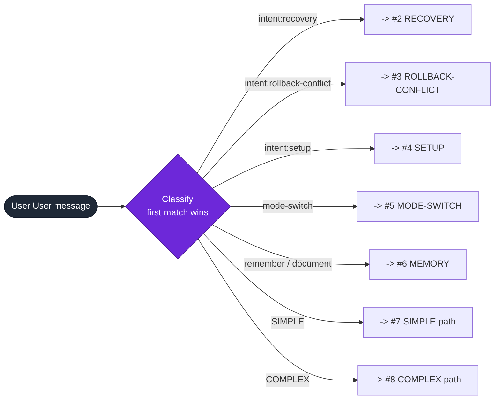
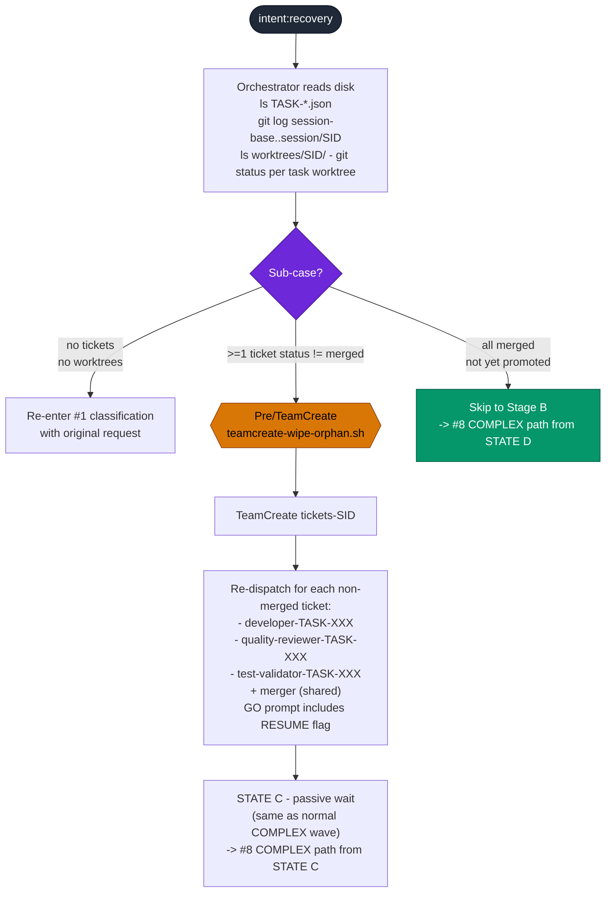
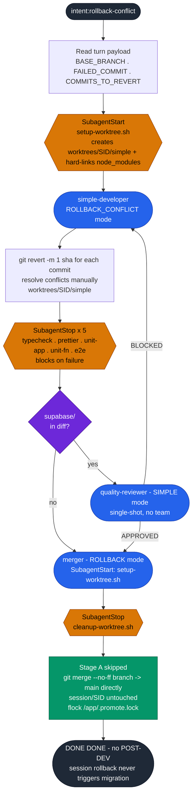
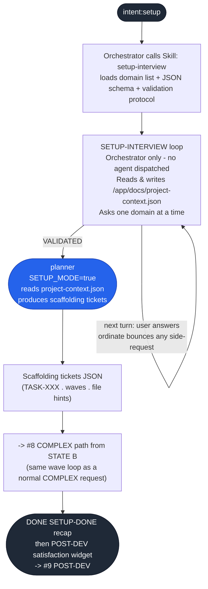
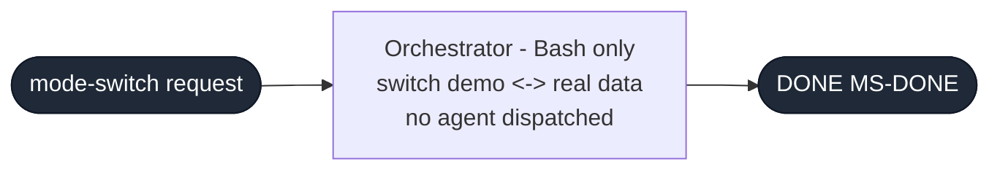
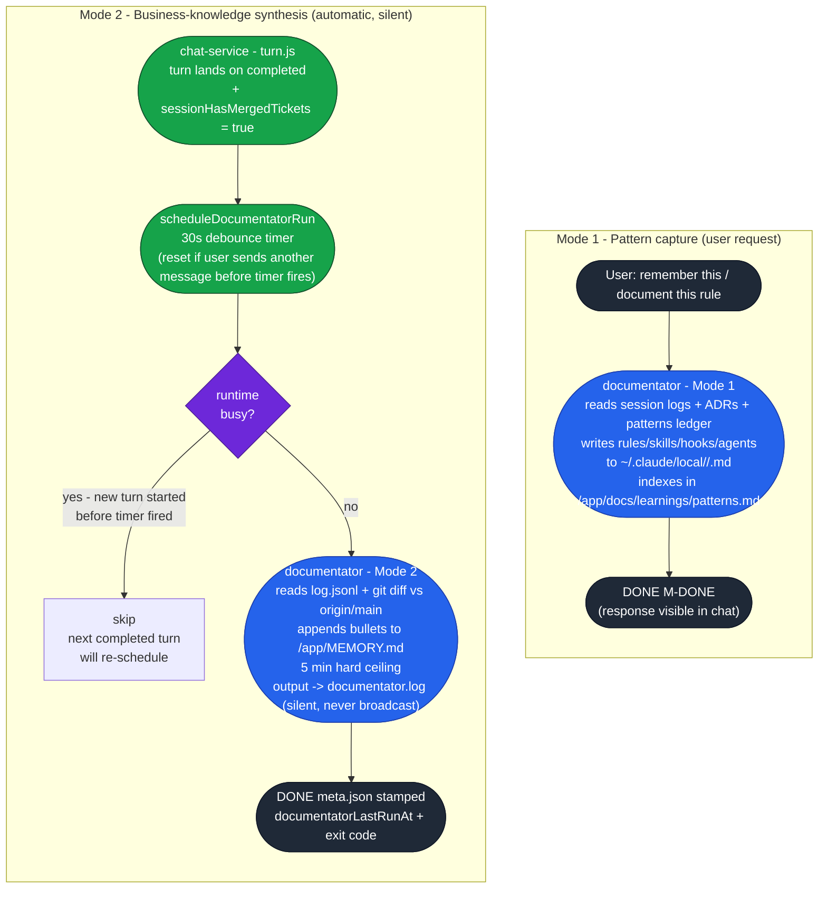
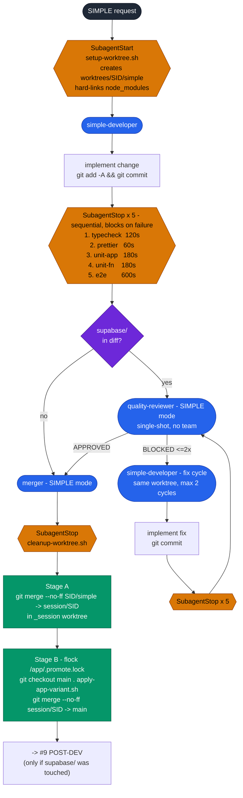
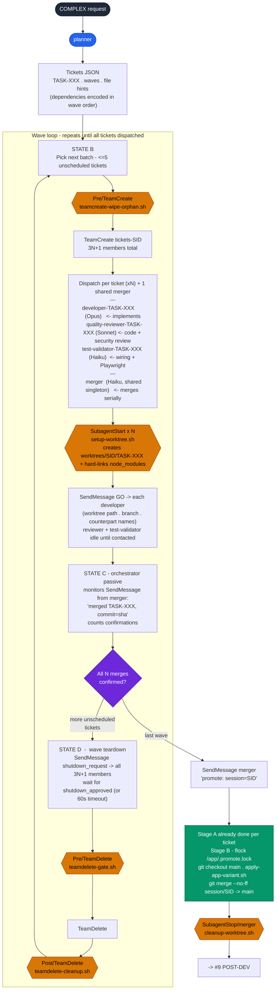
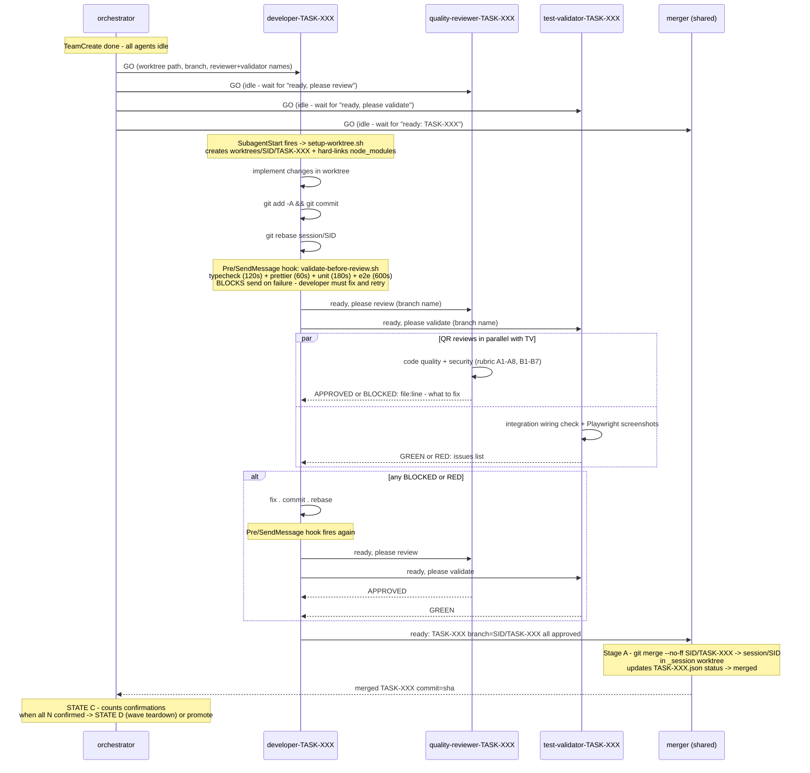
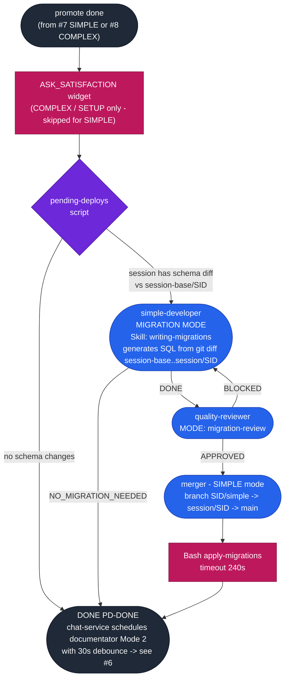

# Agent Workflow Diagram

> **Legend** — applies to all diagrams below
> - 🔵 `([...])` stadium → **agent** (spawned subprocess)
> - 🟡 `{{...}}` hexagon → **hook** (auto-triggered by harness)
> - 🟣 `{...}` diamond → **decision**
> - 🟢 `([...])` green stadium → **chat-service** internal logic (not an agent)

---

## 1. Classification — entry point

Every user message enters here. First match wins.



---

## 2. RECOVERY

Triggered when chat-service injects `<intent>recovery</intent>` on resume (crash or usage limit).



---

## 3. ROLLBACK-CONFLICT

Triggered when `git revert` failed with a merge conflict. chat-service injects `<intent>rollback-conflict</intent>` with `BASE_BRANCH`, `FAILED_COMMIT`, `COMMITS_TO_REVERT`.



---

## 4. SETUP

Triggered on first turn with `<intent>setup</intent>` or natural-language "define my business".



---

## 5. MODE-SWITCH



---

## 6. MEMORY / DOCUMENT

Two independent triggers — Mode 1 is orchestrator-driven, Mode 2 is chat-service-driven.



---

## 7. SIMPLE path

Cosmetic change OR single-field add/remove on an existing entity. No team, no planner.



---

## 8. COMPLEX path

Multi-ticket requests (2+ fields, new entity, cross-entity, new component, ambiguous). Also used by SETUP (#4) from STATE B onward.

### 8a. Wave loop



### 8b. Communication inside one wave — per-ticket agent lifecycle



---

## 9. POST-DEV

Runs after every COMPLEX/SETUP session and after schema-touching SIMPLE. Entry point: promote completed.



---

## 10. Hooks — full reference

### PreToolUse

| Hook | Filtered tool | Effect |
|---|---|---|
| `member-idle-gate` | Bash · Read · Grep · Glob · SendMessage | Blocks calls from agents not registered in the active team |
| `silent-mode-check` | Bash | Verifies agent is running headless |
| `circuit-breaker` | Bash | Detects runaway loops / timeouts |
| `block-bash-file-write` | Bash | Blocks `sed -i`, `echo >`, write redirections |
| `block-bash-validation` | Bash | Blocks manual typecheck/prettier/tests (SubagentStop owns these) |
| `block-orchestrator-merge` | Bash | Prevents orchestrator from calling `git merge` |
| `restrict-documentator-bash` | Bash | Limits documentator to `git log/show/diff/ls/wc` |
| `restrict-documentator-write` | Write · Edit | Limits documentator writes to `~/.claude/local/*` and `/app/MEMORY.md` |
| `block-migration-writes` | Write · Edit | Blocks `supabase/migrations/` except during PD-MIG-DEV |
| `block-premature-shutdowns` | SendMessage | Blocks `shutdown_request` until merger has confirmed all merges |
| **`validate-before-review`** | SendMessage | **Runs typecheck · prettier · unit · e2e before developer → reviewer/merger. Blocks on failure.** |
| `teamcreate-wipe-orphan` | TeamCreate | Removes orphan team of same name from a dead previous run |
| `teamdelete-gate` | TeamDelete | Guards against premature TeamDelete |

### SubagentStart

| Hook | Agent filter | Effect | Timeout |
|---|---|---|---|
| `setup-worktree.sh` | `developer` · `simple-developer` | Creates `/app/worktrees/SID/TASK/` + hard-links `node_modules` | 60s |

### SubagentStop

| Hook | Agent filter | Scripts (sequential) | Timeout |
|---|---|---|---|
| `cleanup-worktree.sh` | `merger` | Removes task + session worktrees | 30s |
| `typecheck-on-commit.sh` | `simple-developer` | TypeScript typecheck | 120s |
| `prettier-on-stop.sh` | `simple-developer` | Prettier | 60s |
| `run-unit-tests-app.sh` | `simple-developer` | Vitest — app | 180s |
| `run-unit-tests-functions.sh` | `simple-developer` | Vitest — functions | 180s |
| `run-e2e-tests.sh` | `simple-developer` | Playwright e2e | 600s |

### PostToolUse

| Hook | Tool | Effect |
|---|---|---|
| `teamdelete-cleanup.sh` | TeamDelete | Cleans up team state after deletion |

---

## 11. Branch & worktree topology

```
origin/main
    └── session/<SID>              ← forked at session start
            ├── session-base/<SID>      (anchor ref — never moves, used for migration diff)
            ├── <SID>/TASK-001          ← developer-TASK-001 branch
            ├── <SID>/TASK-002
            └── <SID>/simple            ← simple-developer branch

Worktrees on disk:
  /app/worktrees/<SID>/TASK-001/       (hard-links node_modules)
  /app/worktrees/<SID>/TASK-002/
  /app/worktrees/<SID>/simple/
  /app/worktrees/<SID>/_session/       (merger Stage A — checked out on session/<SID>)
  /app/worktrees/_deploy/              (deploy-time vite build only — isolated from dev server)

Merge path:
  <SID>/TASK-XXX  ──Stage A──►  session/<SID>  ──Stage B──►  main
                                (per ticket,                  (once per session,
                                 in _session wt)               under flock lock)
```
