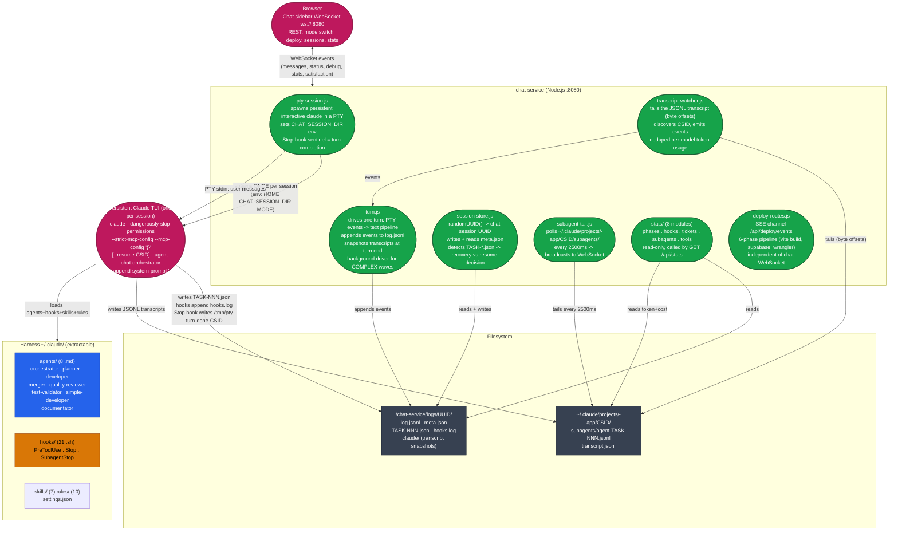

# Chat-Service — Architecture reference

Quick orientation for a fresh session. Covers only chat-service entities and their relationships.

---

## 1. Components & connections

chat-service is a Node.js server (:8080) that sits between the browser and the Claude CLI. Its job: receive a user message over WebSocket, drive a **persistent interactive Claude TUI** through a PTY (one long-lived process per session — no more `claude -p` spawn per message), tail its JSONL transcript into `log.jsonl`, broadcast events to the browser in real time, then aggregate the results into session stats. It never directly modifies CRM code — that's done by the agents running inside the Claude process. See [turn.md](turn.md) for the full turn lifecycle.

**Modules** (`chat-service/lib/`):

| Module | File | Role |
|---|---|---|
| PTY session | `server/pty-session.js` | Spawns the persistent interactive `claude` process in a PTY (`--agent chat-orchestrator`, `[--resume CSID]`, empty `--mcp-config`), sets env vars (`CHAT_SESSION_DIR`, `MODE`, …), answers the TUI's terminal capability queries, detects turn completion via the Stop-hook sentinel |
| Transcript watcher | `server/transcript-watcher.js` | Tails the Claude JSONL transcript (byte-offset incremental reads), discovers the CSID, emits assistant/tool events, accumulates deduped per-model token usage |
| Turn helpers | `server/turn-helpers.js` | Assistant-message extraction, `FULL_SETUP` intent rewrite, resume planning (fresh vs `--resume`), user-facing error text |
| Turn orchestrator | `server/turn.js` | Drives one user turn: PTY events → text pipeline → `log.jsonl` + broadcast, snapshots transcripts at turn end, hands off to the background driver when a COMPLEX wave is still in flight — see [turn.md](turn.md) |
| Session store | `server/session-store.js` | Generates chat UUID, reads/writes `meta.json`, detects `TASK-*.json` to decide resume vs recovery |
| Subagent tailer | `server/subagent-tail.js` | Polls `~/.claude/projects/-app/CSID/subagents/` every 2500ms, broadcasts new lines to WebSocket |
| Stats aggregator | `lib/stats/` (8 modules) | Read-only — folds `log.jsonl` + `TASK-*.json` + `hooks.log` + subagent transcripts into `GET /api/stats` response |
| Deploy routes | `server/deploy-routes.js` | SSE channel `/api/deploy/events`, 6-phase pipeline (vite build → supabase → wrangler), independent of chat WebSocket |

> The former `documentator-spawn.js` is gone: the documentator (Mode 2) is now dispatched by the orchestrator itself via `Agent({ run_in_background: true })` at POST-DEV, once the user validates the result.

**The Claude process** loads the harness (`~/.claude/` — agents, hooks, skills, rules, settings.json) and is the only thing that touches the CRM code. chat-service communicates with it through:
- **Input**: PTY stdin (sanitized text + `\r`), spawn args + env vars (see `claude-cli-fake-contract.md`)
- **Output**: the JSONL transcript under `~/.claude/projects/-app/CSID/` (tailed by `transcript-watcher.js`) — not stdout
- **Completion signal**: the `Stop` hook writes `/tmp/pty-turn-done-<CSID>`; the TUI never exits between turns
- **Filesystem**: `TASK-NNN.json`, `hooks.log`, subagent transcripts under `~/.claude/projects/-app/CSID/`

**Visual overview** (for reference):

---

## 2. Turn lifecycle — step by step

Full reference: [turn.md](turn.md).

| Step | Module | What happens |
|---|---|---|
| 1 | `turn.js` | Receives message from WebSocket queue, broadcasts `status:working=true` |
| 2 | `session-store.js` | Checks state + TASK-*.json presence: plain resume, or fresh session + `<intent>recovery</intent>` (`planResume`) |
| 3 | `pty-session.js` | Spawns the persistent PTY claude process if absent (`[--resume CSID]`), or reuses the live one; `send()` queues until the TUI prompt is ready, then writes the message |
| 4 | `transcript-watcher.js` | Tails the JSONL transcript: discovers the CSID on first sight, emits assistant/tool events, accumulates deduped token usage |
| 5 | `turn.js` | Per event: broadcasts `debug_raw`, runs the orchestrator text pipeline (title/widget strip, dedup, broadcast + `log.jsonl`), progress-bar + agent accounting |
| 6 | `subagent-tail.js` | Polls `~/.claude/projects/-app/CSID/subagents/` every 2500ms, broadcasts new lines to WebSocket |
| 7 | CLI / hooks | Planner writes `TASK-NNN.json`, hooks append `hooks.log`, agents write transcripts, worktrees created/merged |
| 8 | `pty-session.js` | Turn completion = `Stop` hook sentinel `/tmp/pty-turn-done-<CSID>` (positive signal); 120s silence fallback (degraded — `classifyTurn` decides completed vs failed) |
| 9 | `turn.js` (finally) | Folds per-spawn usage into cumulative stats, snapshots `~/.claude/projects/-app/CSID/` to `/logs/UUID/claude/`, updates `meta.json`, broadcasts `status:working=false`, drains the queue |
| 10 | `turn.js` (background) | COMPLEX waves run as background turns: `Agent({ run_in_background: true })` completions wake the idle TUI; an inactivity watchdog + heartbeat driver nudge or give up |

The documentator (Mode 2) is dispatched by the orchestrator itself at POST-DEV (background `Agent` call) once the user validates the result — no chat-service trigger.

---

## 3. WebSocket event types

| Event type | Emitted when | Key fields |
|---|---|---|
| `status` | turn starts / ends | `{ working: true\|false }` |
| `message` | assistant text or user message | `{ role, content, ts }` |
| `debug_raw` | every transcript event from Claude | `{ event }` |
| `debug` | tool use detected | `{ tool, input, agent }` |
| `satisfaction_ask` | orchestrator signals satisfaction check | `{ header, body, yes, no }` |
| `rate_limited` | Claude hits rate limit | `{ resetsAt }` |
| `state` | session state changes | `{ state }` |
| `queue_updated` | new message queued | `{ queuedIds }` |
| `title` | session title set | `{ title }` |
| `stats` | token/cost update | `{ tokensUsed, costUsd, activeAgents }` |

---

## 4. Session & ID reference

| Identifier | Example | Source |
|---|---|---|
| chat session UUID | `a1b2c3d4-e5f6-7890-1234-567890abcdef` | `randomUUID()` in `session-store.js` |
| SESSION_SHORT | `a1b2c3d4` | first UUID segment — `cut -d'-' -f1` in hooks |
| claudeSessionId (CSID) | `conv_0123abc` | Claude CLI's own ID, discovered by `transcript-watcher.js` from the transcript's `session_id` |
| CHAT_SESSION_DIR | `/chat-service/logs/UUID` | env var set by `pty-session.js` |
| transcript base | `~/.claude/projects/-app/CSID/` | CWD `/app` with `/` replaced by `-` |
